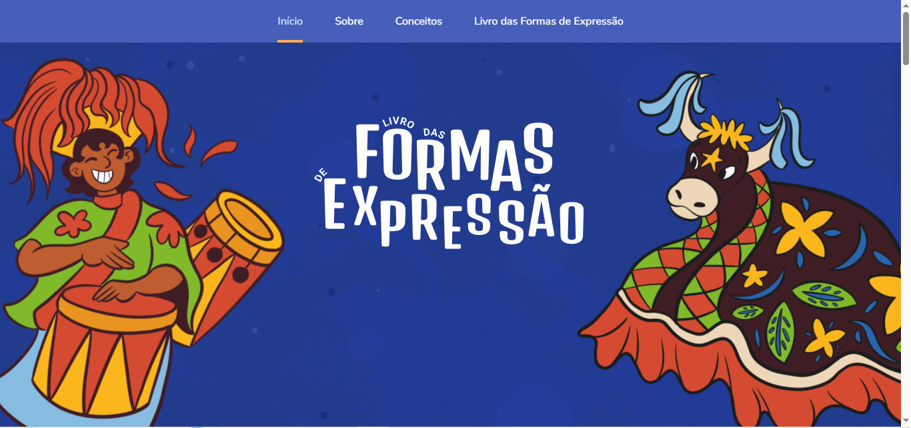
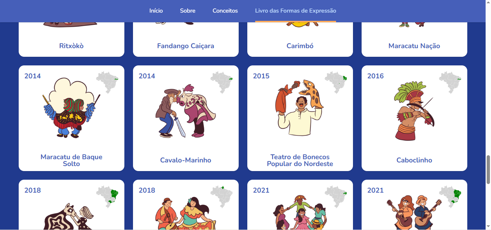
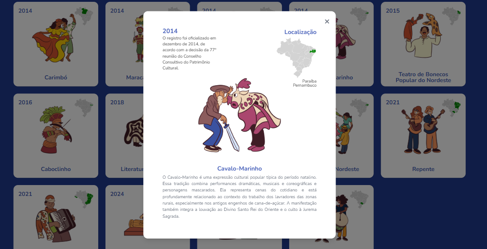

<p align="center">
  
</p>

<h1 align="center">
  Infográfico Interativo - Livro das Formas de Expressão
</h1>

<p align="center">
  Um infográfico web interativo desenvolvido para difundir o patrimônio cultural imaterial brasileiro registrado pelo IPHAN por meio de Visualização da Informação, Design de Interação e UX/UI.
</p>

<p align="center">
  
  
  
  
</p>

---

# Sobre o Projeto

O **Infográfico Interativo – Livro das Formas de Expressão** é uma aplicação web desenvolvida como Trabalho de Conclusão de Curso (TCC) do Bacharelado em Sistemas e Mídias Digitais da Universidade Federal do Ceará (UFC).

O projeto aplica conceitos de **Visualização da Informação (Information Visualization)**, **Arquitetura da Informação**, **Design de Interação** e **UX/UI** para transformar informações sobre o patrimônio cultural imaterial brasileiro em uma experiência digital interativa.

A primeira versão apresenta os bens registrados no **Livro das Formas de Expressão**, pertencente ao sistema de registro de bens culturais imateriais do Instituto do Patrimônio Histórico e Artístico Nacional (IPHAN), oferecendo uma navegação intuitiva e uma organização visual que facilita a exploração do conteúdo.

Embora esta versão seja voltada ao Livro das Formas de Expressão, toda a aplicação foi planejada para evoluir para uma plataforma completa de difusão do patrimônio cultural brasileiro.

---

# Demonstração

🌐 **Acesse a aplicação**

https://infografico-interativo.vercel.app

---

# Objetivos

- Promover a difusão do patrimônio cultural imaterial brasileiro.
- Facilitar a exploração dos bens registrados pelo IPHAN.
- Aplicar princípios de Visualização da Informação em ambiente web.
- Desenvolver uma interface intuitiva baseada em feature-based.
- Explorar recursos de Design de Interação para apresentação de conteúdos culturais.
- Estruturar uma aplicação escalável preparada para futuras expansões.

---

# Contexto

O Instituto do Patrimônio Histórico e Artístico Nacional (IPHAN) organiza o patrimônio cultural imaterial brasileiro em diferentes **Livros de Registro**, cada um dedicado a um conjunto específico de manifestações culturais.

Esta primeira versão contempla exclusivamente o **Livro das Formas de Expressão**, responsável por reunir manifestações como:

- Literatura de Cordel;
- Roda de Capoeira;
- Matrizes do Samba no Rio de Janeiro;
- Demais bens culturais registrados nesta categoria.

O objetivo é apresentar essas manifestações por meio de uma experiência digital capaz de tornar informações históricas e culturais mais acessíveis ao público.

---

# Funcionalidades

## Implementadas

- Navegação por seções.
- Interface responsiva.
- Cards interativos dos bens culturais.
- Overlay com informações detalhadas.
- Organização baseada em Arquitetura da Informação.
- Hierarquia visual para facilitar a compreensão do conteúdo.
- Experiência otimizada para exploração dos bens culturais.

## Arquitetura preparada para

- Integração com API REST.
- Carregamento dinâmico dos conteúdos.
- Cadastro de novos bens culturais.
- Edição das informações existentes.
- Inclusão de novos Livros de Registro.
- Painel administrativo para gerenciamento do acervo.
- Persistência de dados em banco de dados.

---

# Tecnologias

- React
- TypeScript
- Vite
- HTML5
- CSS3

---

# Arquitetura da Aplicação

O projeto foi concebido utilizando uma arquitetura desacoplada entre **Frontend** e **Backend**, permitindo maior escalabilidade, reutilização de serviços e facilidade de manutenção.

```text
                 Usuário
                    │
                    ▼
        React + TypeScript (Frontend)
                    │
             Requisições HTTP
                    │
                    ▼
              API REST (Backend)
                    │
                    ▼
              Banco de Dados
```

Embora este repositório contenha apenas o frontend da aplicação, sua estrutura foi projetada para integração com um backend responsável pelo gerenciamento do conteúdo apresentado no infográfico.

Essa arquitetura permite que todas as informações exibidas sejam carregadas dinamicamente, tornando possível administrar o sistema sem necessidade de alterações no código da interface.

---

# Estrutura do Projeto

```text
src/
│
├── assets/
├── shared/
│   ├── components/
├── features/
│   ├── admin/
│   ├── auth/
│   ├── home/
│   ├── bem/
│   ├── registry-books/
├── styles/
├── services/
└── App.tsx
```

---

# Visualização da Informação

Diferentemente de dashboards tradicionais, este projeto aplica princípios de **Information Visualization (InfoVis)** para organizar e apresentar informações culturais de forma clara e interativa.

Entre as estratégias utilizadas destacam-se:

- Organização hierárquica das informações.
- Segmentação do conteúdo em seções.
- Modularização por meio de cards.
- Divulgação progressiva das informações através de overlays.
- Navegação contextual.
- Uso de ilustrações como apoio visual.
- Redução da carga cognitiva durante a exploração do conteúdo.

Esses princípios são amplamente utilizados em sistemas de visualização de dados, dashboards e plataformas analíticas, sendo adaptados neste projeto ao contexto da difusão do patrimônio cultural.

---

# Design

O desenvolvimento da interface foi fundamentado nos princípios de:

- Visualização da Informação;
- Arquitetura da Informação;
- UX Design;
- Design de Interação;
- Hierarquia Visual;
- Design Responsivo;
- Acessibilidade.

As ilustrações utilizadas na plataforma foram desenvolvidas exclusivamente para o projeto, contribuindo para reforçar a identidade visual e facilitar a compreensão das manifestações culturais apresentadas.

---

# Roadmap

## Concluído

- [x] Estrutura da aplicação.
- [x] Integração completa com o backend.
- [x] Livro das Formas de Expressão.
- [x] Cadastro de novos bens culturais.
- [x] Edição de conteúdos.
- [x] Painel administrativo.
- [x] Interface responsiva.

## Planejado

- [ ] Inclusão do Livro dos Saberes.
- [ ] Inclusão do Livro das Celebrações.
- [ ] Inclusão do Livro dos Lugares.

---

# Capturas de Tela

| Página Inicial | Livro das Formas | Informações |
|----------------|------------------|-------------|
|  |  |  |

---

# Competências Aplicadas

Este projeto reúne conhecimentos em diferentes áreas do desenvolvimento e do design digital, incluindo:

- Front-end Development and back-end integration.
- React
- TypeScript
- Information Visualization
- Information Architecture
- UI/UX Design
- Human-Computer Interaction (HCI)
- Responsive Web Design
- Digital Cultural Heritage

---

# Equipe

| Integrante  | Responsabilidade |
|------------ |------------------|
| **Mateus de Aquino**  | Desenvolvimento Full-Stack, Arquitetura da Aplicação, UX/UI Design, Visualização da Informação e Pesquisa |
| **Pamela de Castro**  | Ilustrações e artes |

---

# Projeto Acadêmico

Este projeto foi desenvolvido como Trabalho de Conclusão de Curso (TCC) do Bacharelado em Sistemas e Mídias Digitais da Universidade Federal do Ceará (UFC).

A pesquisa teve como objetivo elaborar e desenvolver uma aplicação web completa seguindo princípios de Visualização da Informação e Design de Interação podem contribuir para a difusão digital do patrimônio cultural imaterial brasileiro.

---

# Licença

Este projeto foi desenvolvido para fins acadêmicos e de pesquisa.
````
